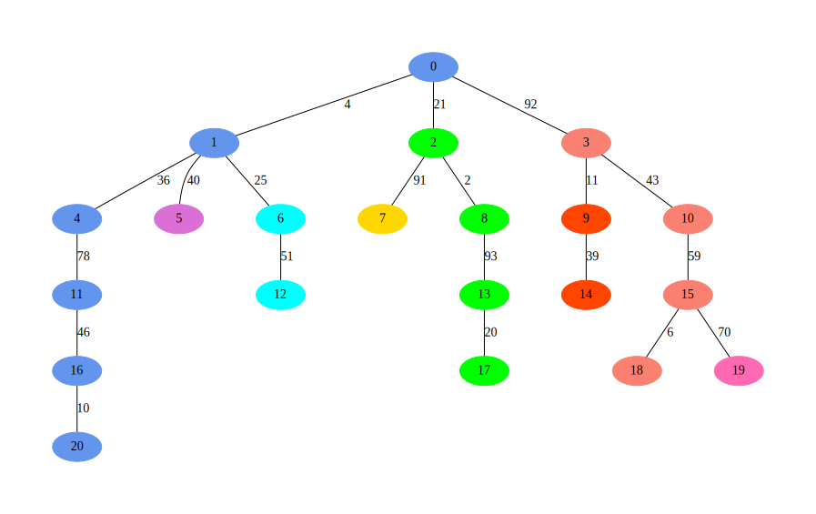
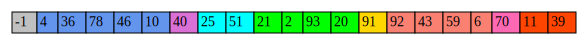

# Heavy Light Decomposition

En esencia, se rompe un árbol en cadenas en las cuales se pueden hacer consultas por rango.
La forma de romper el árbol es la siguiente:

Se diferencian los hijos de un vertice por el tamaño de sus subárboles
El hijo con el mayor subárbol será miembro de la cadena del padre.
El resto de los hijos crearán nuevas cadenas.


### Información que se necesita por vertice
* Su padre
* El tamaño de su subárbol
* Su profundidad
* Su jefe de cadena
* Su cadena

### DFS
Useremos un DFS para obtener la información necesaria por vertice para realizar la decomposición del árbol es un conjunto de listas de aristas.
La información que se obtendrá será:
* El padre de un vertice `v`, que lo almacenaremos en un arreglo llamado `parent`
* El tamaño del subárbol del vertice `v`, que se almacenará en un arreglo llamado `subsize`
* La profundidad del vertice `v` en comparación con la raíz del árbol en un arreglo llamado `depth`

La implementación de este bfs es recursiva que retornará el valor del subárbol del hijo de un vertice `v` al final de su ejecución, este valor luego será sumado con todos los hijos de `v` para obtener el valor del árbol de `v`.

```python
def dfs(u, father, depth_value):
  parent[u] = father
  depth[u] = depth_value
  size = 1
  for v in childs(v):
    size += dfs(v, u, depth_value + 1)
  subsize[u] = size
  return size

```
Utilizaremos una función `childs(u)` que entrega la lista de hijos del vertice `u`.

Los valores obtenidos por el dfs serán utilizados tanto para la descomposición del árbol como para hacer las consultas posteriormente.

### Descomponer el árbol
Vamos a descomponer el árbol en un conjunto de cadenas para optimizar el tiempo de consultas, el criterio sobre si agregar un vertice a una cadena ya existente está dado por si es el hijo "más pesado" (hint: ahi viene lo de Heavy) de su padre. El resto de los hermanos del vertice pertenecerán a nuevas cadenas.



Además almacenamos la información restante para el vertice que se necesaria en las consulta y se llenará un arreglo llamado `values` que contiene el peso de las aristas en árbol, con un puntero global indicamos que posición en el arreglo `values` estará en la arista entre el vertice `v` y su padre.
```python
def hld(u, cost, chain):
  chainIndex[u] = chain
  valuesIndex[u] = ptr
  ptr += 1
  values[ptr] = cost

  if leaf(u):
    return

  heavy_child = heavy_child(u)
  heavy_cost =  cost(u, heavy_child)
  head[heavy_child] = u
  hld(heavy_child, heavy_cost, chain)

  for child in childs(u):
    if child  != heavy_child:
      head[child] = child
      hld(child, cost(u, child), newChain())

  return
```
Las funciones auxiliares:
* `leaf(u)`: Función booleana que retorna `true` si el vertice `u` es una hoja del árbol.
* `heavy_child(u)`: Función que retorna el vertice que corresponde al hijo con mayor subárbol del vertice `u`.
* `cost(u,v)`: Función que retorna el costo de la arista entre `u` y `v`.
* `newChain()`: Función que genera el indice de una nueva cadena.


Donde los arreglos son:
* `head`: Almacena el jefe de la cadena del vertice `u`.
* `chainIndex`: Almacena el número de la cadena de cada vetice.
* `values`: Almacena el peso de la arista de un padre a un hijo.
* `valuesIndex`: Almacena la posición donde se inserta el peso de la arista `costo` en `values`.

Estos usando el árbol de ejemplo los arreglos tendrían estos contenidos:

| Vertices    | 0  | 1 | 2 | 3  | 4 | 5 | 6 | 7  | 8 | 9  | 10 | 11 | 12 | 13 | 14 | 15 | 16 | 17 | 18 | 19 | 20 |
| ------------|:--:|:-:|:-:|:--:|:-:|:-:|:-:|:--:|:-:|:--:|:--:|:--:|:--:|:--:|:--:|:--:|:--:|:--:|:--:|:--:|:--:|
| Head        | 0  | 0 | 2 | 3  | 0 | 5 | 6 | 7  | 2 | 9  | 3  | 0  | 6  | 2  | 9  | 3  | 0  | 2  | 3  | 19 | 0  |
| chainIndex  | 0  | 0 | 3 | 5  | 0 | 1 | 2 | 4  | 3 | 7  | 5  | 0  | 2  | 3  | 7  | 5  | 0  | 3  | 5  | 6  | 0  |
| valuesIndex | -1 | 0 | 8 | 13 | 1 | 5 | 6 | 12 | 9 | 18 | 14 | 2  | 7  | 10 | 19 | 15 | 3  | 11 | 16 | 17 | 4  |
Una vez terminado la descomposición se inserta el arreglo `values` en un segment tree que nos permitirá hacer las consultas.
### Las consultas
Entonces, tenemos una serie de arreglos que tienen almacenado la información necesaria para hacer las consultas y un segment tree para hacer consultas de rango. Como carajos hacemos las consultas?

Es simple, el segment tree está ordenado por las cadenas, es decir, estarán todas las aristas de la cadena 1 al principio, seguido por las aristas de la cadena 2 y asi sucesivamente como se ve en la siguiente imagen que corresponde al arreglo values del ejemplo anterior.



Por lo tanto al recibir una consulta de rango entre el vertice `u` y el vertice `v` nos preguntaremos: ¿ están en la misma cadena?, si lo estan es tan simple como hacer una consulta por rango en un arreglo con un segment tree.

Pero, y si no?. Aqui es donde sale la magia de la descomposición, como `u` y `v` no están en la misma cadena, entonces hay que de alguna forma lograr que lleguen a la misma cadena, para ello haremos consultas por rango desde el vertice `u` hasta su jefe de cadena y saltaremos hacia el padre del jefe de la cadena de `u`. Esto lo repetiremos hasta que lleguemos al caso anterior.


Se preguntarán que pasa con el vertice `v`, porque ese vertice jamas lo movemos? la razón de aquello está explicado en el siguiente punto pero en esencia es que antes de hacer la consulta romperemos la consulta entre `u` y `v` en dos consultas: entre `query(u, lca(u,v))` y  `query(v, lca(u,v))`.

```python
def query(u, v):
  ans = 0;
  while True:
    if chainIndex[u] == chainIndex[v]:
      ans = max(RMQ(valuesIndex[v] + 1, valuesIndex[u]), ans)
      break
    else:
      ans = max(RMQ(valuesIndex[head[u]], valuesIndex[u]), ans)
      u = parent[head[u]]

  return ans
```
### Lowest Common Ancestor

```python
def lca(u, v):
  while head[u] != head[v]:
    if depth[head[u]] > depth[head[v]]:
      u = parent[head[u]]
    else:
      v = parent[head[v]]
  if depth[u] > depth[v]:
    return v
  else:
    return u
```
